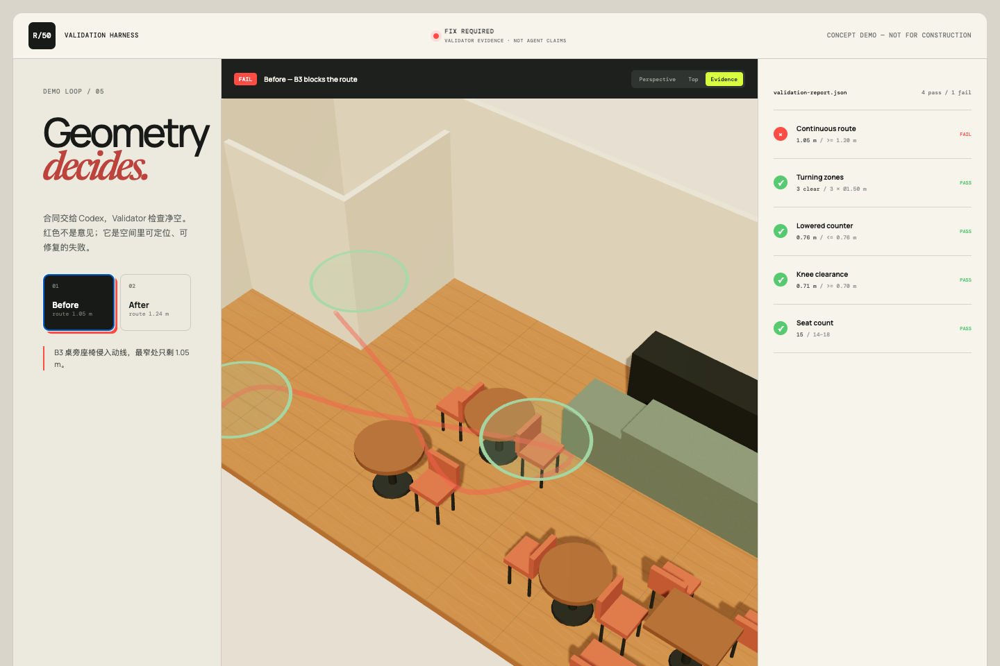
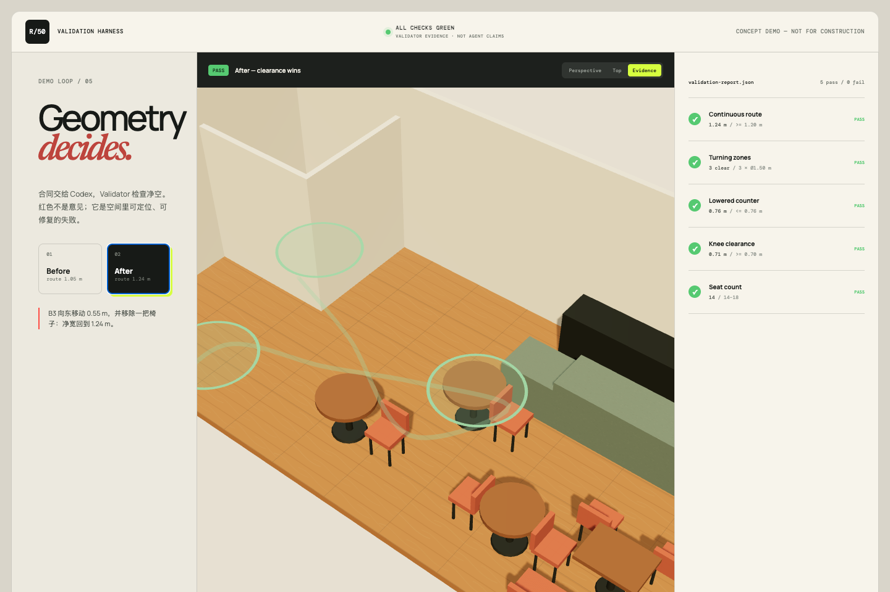

# ROOM/50 evidence demo

Serve the repository root, then open `/demo/`:

```sh
python3 -m http.server 4173
```

The demo reads a scene brief and validation report through the same public interface used by the final harness. `fail` and `pass` fixtures make the story deterministic when a live agent run is unsuitable for a stage demo.

Useful URLs:

- `/demo/#fail` — B3 constrains the route to 1.05 m.
- `/demo/#pass` — B3 moves, one chair is removed, and the route clears at 1.24 m.

The evidence overlay is generated from `violationGeometry` or `evidenceGeometry` in the report. It is not inferred from scene styling.

| Validator fail | Repaired scene |
| --- | --- |
|  |  |

## Reuse the kit

```js
import { createStarterScene } from "/kit/starter-scene.js";

const viewer = await createStarterScene({
  container: document.querySelector("#viewer"),
  brief: "/scene-brief.json",
  report: "/validation-report.json",
  preset: "hearth",
  view: "accessibility",
});

viewer.setView("top");
viewer.setPreset("linen");
viewer.setLighting("night");
```

Accepted core object fields are `{ id, semanticTag, position: [x,z], rotation, bbox: {w,d,h} }`. The loader also accepts common aliases and nested `scene.objects` / `room.shell` structures so that minor schema-envelope changes do not break the renderer.

All dimensions are concept-demo targets, not code certification or construction guidance.
